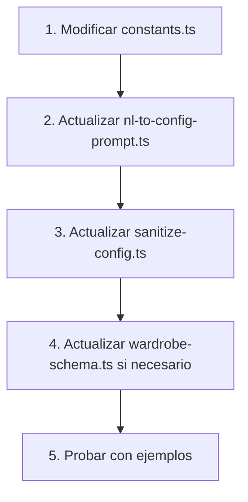

# Guía de Configuración del Sistema de IA

Esta guía explica cómo mantener sincronizado el sistema cuando se realizan cambios en las reglas de negocio, límites, materiales, o cualquier otra configuración del placard.

## 🎯 Principio Fundamental

**El sistema tiene UNA ÚNICA FUENTE DE VERDAD: `src/lib/constants.ts`**

Cuando cambies algo en `constants.ts`, debes actualizar el prompt de IA para que refleje esos cambios.

---

## 📁 Archivos Clave

### 1. **Source of Truth** (Fuente de Verdad)

#### [`src/lib/constants.ts`](file:///Users/santiagomartini/aerolab/carpinter-ia/src/lib/constants.ts)
- **Qué contiene:** Todos los límites, rangos, materiales, y reglas del sistema
- **Cuándo modificar:** Cuando cambies reglas de negocio
- **Ejemplos:**
  - Cambiar límite máximo de ancho de sección
  - Agregar nuevo material
  - Modificar rangos de altura de colgado
  - Cambiar reglas ergonómicas

### 2. **AI Prompt** (Prompt de IA)

#### [`src/lib/prompts/nl-to-config-prompt.ts`](file:///Users/santiagomartini/aerolab/carpinter-ia/src/lib/prompts/nl-to-config-prompt.ts)
- **Qué contiene:** Instrucciones para que OpenAI genere configuraciones válidas
- **Cuándo modificar:** SIEMPRE que modifiques `constants.ts`
- **Importante:** Debe reflejar exactamente los valores de `constants.ts`

### 3. **Sanitization** (Auto-corrección)

#### [`src/lib/utils/sanitize-config.ts`](file:///Users/santiagomartini/aerolab/carpinter-ia/src/lib/utils/sanitize-config.ts)
- **Qué contiene:** Lógica para ajustar valores inválidos al límite más cercano
- **Cuándo modificar:** Cuando cambies límites en `constants.ts`
- **Función:** Evita errores ajustando automáticamente valores fuera de rango

### 4. **Schema Validation** (Validación)

#### [`src/schemas/wardrobe-schema.ts`](file:///Users/santiagomartini/aerolab/carpinter-ia/src/schemas/wardrobe-schema.ts)
- **Qué contiene:** Schemas de Zod que validan la estructura de datos
- **Cuándo modificar:** Cuando agregues nuevos campos o cambies tipos de datos
- **Importante:** Debe estar sincronizado con `constants.ts`

---

## 🔄 Flujo de Cambios

Cuando hagas un cambio, sigue este orden:



---

## 📝 Ejemplos de Cambios Comunes

### Ejemplo 1: Cambiar Límite Máximo de Ancho de Sección

**Escenario:** Quieres cambiar el límite de 900mm a 1000mm

#### Paso 1: Modificar `constants.ts`

```typescript
// src/lib/constants.ts
export const SECTION_WIDTH_LIMITS = {
  min: 400,
  max: 1000, // ← Cambiar de 900 a 1000
  recommended: [600, 800, 1000] as const, // ← Actualizar recomendados
} as const;
```

#### Paso 2: Actualizar `nl-to-config-prompt.ts`

```typescript
// src/lib/prompts/nl-to-config-prompt.ts
export const SYSTEM_PROMPT = `...

2. SECCIONES:
   - Ancho por sección: 400-1000mm (NUNCA más de 1000mm) // ← Actualizar
   - Anchos recomendados: 600, 800, 1000mm // ← Actualizar
   ...

3. DIVISIÓN DE SECCIONES (CRÍTICO):
   - width 2000mm → 2 secciones de 1000mm // ← Actualizar ejemplos
   - width 2400mm → 3 secciones de 800mm
   - NUNCA crear sección > 1000mm // ← Actualizar
...`;
```

#### Paso 3: Actualizar `sanitize-config.ts`

```typescript
// src/lib/utils/sanitize-config.ts
import { SECTION_WIDTH_LIMITS } from "@/lib/constants";

// La función ya usa SECTION_WIDTH_LIMITS.max automáticamente
// No necesitas cambiar nada si usas las constantes importadas ✅
```

#### Paso 4: Probar

```bash
# Prueba con diferentes anchos
"placard de 2 metros"  # Debería crear 2 secciones de 1000mm
"placard de 3 metros"  # Debería crear 3 secciones de 1000mm
```

---

### Ejemplo 2: Agregar Nuevo Material

**Escenario:** Quieres agregar "Melamina Negro"

#### Paso 1: Modificar `constants.ts`

```typescript
// src/lib/constants.ts
export const MATERIAL_CATALOG: Record<string, MaterialSpec> = {
  // ... materiales existentes
  melamina_negro: {
    id: "melamina_negro",
    label: "Melamina Negro",
    thickness: 18,
    color: "#1A1A1A",
    roughness: 0.85,
    metalness: 0.15,
  },
};
```

#### Paso 2: Actualizar `nl-to-config-prompt.ts`

```typescript
// src/lib/prompts/nl-to-config-prompt.ts
export const SYSTEM_PROMPT = `...

7. MATERIALES DISPONIBLES:
   - melamina_blanco: {...}
   - melamina_roble: {...}
   - melamina_nogal: {...}
   - melamina_gris: {...}
   - melamina_negro: {"id":"melamina_negro","label":"Melamina Negro","thickness":18,"color":"#1A1A1A","roughness":0.85,"metalness":0.15} // ← AGREGAR

...

MATERIALES:
- "blanco" / "white" → melamina_blanco
- "roble" / "madera clara" → melamina_roble
- "nogal" / "madera oscura" → melamina_nogal
- "gris" / "gray" → melamina_gris
- "negro" / "black" → melamina_negro // ← AGREGAR
...`;
```

#### Paso 3: Actualizar `wardrobe-schema.ts` (si es necesario)

```typescript
// src/schemas/wardrobe-schema.ts
export const materialIdSchema = z.enum([
  "melamina_blanco",
  "melamina_roble",
  "melamina_nogal",
  "melamina_gris",
  "melamina_negro", // ← AGREGAR
]);
```

#### Paso 4: Probar

```bash
# Prueba con el nuevo material
"placard de color negro"  # Debería usar melamina_negro
```

---

### Ejemplo 3: Cambiar Rangos de Altura de Colgado

**Escenario:** Quieres que el colgado largo vaya de 1600mm a 2000mm (en lugar de 1500-1800)

#### Paso 1: Modificar `constants.ts`

```typescript
// src/lib/constants.ts
export const HANGING_HEIGHT_RANGES: Record<HangingVariant, {...}> = {
  largo: {
    min: 1600, // ← Cambiar de 1500 a 1600
    max: 2000, // ← Cambiar de 1800 a 2000
    label: "Colgado Largo",
    description: "Vestidos de fiesta, abrigos, tapados",
  },
  // ... otros
};
```

#### Paso 2: Actualizar `nl-to-config-prompt.ts`

```typescript
// src/lib/prompts/nl-to-config-prompt.ts
export const SYSTEM_PROMPT = `...

4. MÓDULOS - COLGADO (hanging):
   Variantes y rangos de altura:
   - "largo": 1600-2000mm (vestidos, abrigos, tapados) // ← Actualizar
   - "medio": 1000-1150mm (camisas, blusas, sacos, chaquetas)
   - "corto": 700-900mm (pantalones doblados, faldas)
...`;
```

#### Paso 3: Actualizar `sanitize-config.ts`

```typescript
// src/lib/utils/sanitize-config.ts
import { HANGING_HEIGHT_RANGES } from "@/lib/constants";

// Mejor práctica: usar las constantes importadas
if (module.type === "hanging") {
  const range = HANGING_HEIGHT_RANGES[module.variant];
  return {
    ...module,
    height: clamp(module.height, range.min, range.max), // ← Usa constantes
  };
}
```

#### Paso 4: Actualizar `wardrobe-schema.ts`

```typescript
// src/schemas/wardrobe-schema.ts
export const hangingModuleSchema = z.object({
  type: z.literal("hanging"),
  id: z.string(),
  variant: hangingVariantSchema,
  height: z.number().int().min(700).max(2000), // ← Actualizar max
  // ... otros campos
});
```

---

## ✅ Checklist de Sincronización

Cuando hagas cambios, verifica:

- [ ] `constants.ts` tiene los nuevos valores
- [ ] `nl-to-config-prompt.ts` refleja exactamente los mismos valores
- [ ] `sanitize-config.ts` usa las constantes importadas (no hardcoded)
- [ ] `wardrobe-schema.ts` tiene los límites correctos en Zod
- [ ] Probaste con ejemplos reales de lenguaje natural
- [ ] Los logs de consola no muestran warnings de sanitización inesperados

---

## 🧪 Testing

### Pruebas Manuales

```bash
# 1. Inicia el servidor
npm run dev

# 2. Ve a http://localhost:3000

# 3. Prueba casos límite:
"placard de 6 metros"           # Máximo ancho
"placard de 60cm"               # Mínimo ancho
"placard de 3 metros de alto"   # Máximo altura
"placard de color negro"        # Nuevo material
"vestidos muy largos"           # Colgado largo con nuevo rango
```

### Verificar en Consola

Busca estos logs:
```
Processing transcript: ...
Calling OpenAI API...
Validating config with Zod...
Generated config: <uuid>
```

Si ves warnings de sanitización, verifica que el prompt esté actualizado:
```
Section 0 width 1300mm exceeds max 900mm. Clamping.
```

---

## 🚨 Errores Comunes

### Error 1: "Too big: expected number to be <=900"

**Causa:** El prompt no está sincronizado con `constants.ts`

**Solución:** Actualiza `nl-to-config-prompt.ts` con los nuevos límites

---

### Error 2: "Invalid enum value"

**Causa:** Agregaste un material en `constants.ts` pero no en `wardrobe-schema.ts`

**Solución:** Actualiza el enum en `materialIdSchema`

---

### Error 3: "Invalid input: expected number, received undefined"

**Causa:** El prompt no especifica que un campo es OBLIGATORIO

**Solución:** Agrega el campo a la sección "SCHEMAS COMPLETOS DE MÓDULOS" del prompt

---

## 📚 Recursos Adicionales

- [constants.ts](file:///Users/santiagomartini/aerolab/carpinter-ia/src/lib/constants.ts) - Fuente de verdad
- [nl-to-config-prompt.ts](file:///Users/santiagomartini/aerolab/carpinter-ia/src/lib/prompts/nl-to-config-prompt.ts) - Prompt de IA
- [sanitize-config.ts](file:///Users/santiagomartini/aerolab/carpinter-ia/src/lib/utils/sanitize-config.ts) - Auto-corrección
- [wardrobe-schema.ts](file:///Users/santiagomartini/aerolab/carpinter-ia/src/schemas/wardrobe-schema.ts) - Validación Zod

---

## 🎓 Mejores Prácticas

1. **Siempre usa constantes importadas** en lugar de valores hardcoded
2. **Actualiza el prompt inmediatamente** después de cambiar `constants.ts`
3. **Prueba con casos límite** después de cada cambio
4. **Documenta cambios importantes** en el commit message
5. **Verifica que no haya warnings** de sanitización inesperados

---

## 💡 Tips

- El prompt es muy largo porque OpenAI necesita contexto completo
- Los ejemplos en el prompt son cruciales para que la IA entienda
- La sanitización es tu red de seguridad, pero el prompt debe ser preciso
- Si ves muchos warnings de sanitización, el prompt necesita mejoras

---

**Última actualización:** 2026-02-06
